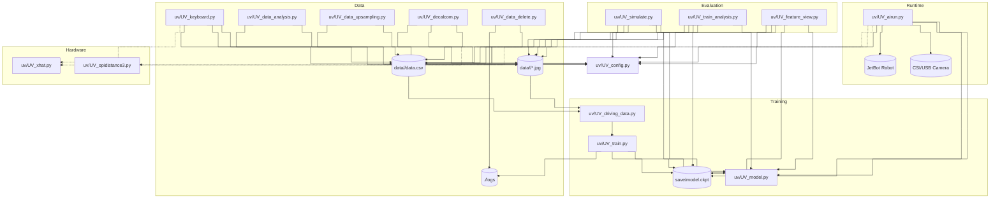

# UV_future-mobility-design-competition
UV 팀 미래 모빌리티 경진 대회 (인천대학교 공학교육혁신 센터)

## 딥 러닝을 활용한 운전자의 주행 학습

### Manual
0. uv 폴더를 다운받은 뒤 터미널 실행 후 작업공간으로 이동한다.
```
cd uv
```
1. keyboard.py를 실행 시켜 주행 데이터를 수집한다.( sudo password : jetbot )
```
sudo python3 keyboard.py
```
1.1 's'버튼 키보드 조작, 'r' 데이터 기록 버튼,

&nbsp;&nbsp;&nbsp;&nbsp;&nbsp;'&#8592;': 좌회전, '&#8593;': 전진, '&#8594;': 우회전, '&#8595;': 3초 정지 후 출발 


2. 수집된 데이터의 비율를 조정하기 위해 decalcom.py, data_upsampling.py를 실행 한다. 이때 data_analysis.py를 사용하여 각 방향에 대한 비율을 적절히 조정한다.

```
sudo python3 decalcom
sudo python3 data_analysis
sudo python3 data_upsampling
```

3. train.py를 실행하여 현재 샘플링한 데이터를 기반으로 model을 학습시킨다.
```
sudo python3 train.py
```

4. airun.py를 통해 저장된 model을 실행 시킬수 있다. ( 카메라 화면 켜진 후 a 버튼으로 자율주행 시작 )
```
sudo python3 airun.py
```


*** 이미 학습된 모델이 있으므로 4단계를 실행 하시면 됩니다.

## 코드 구조

